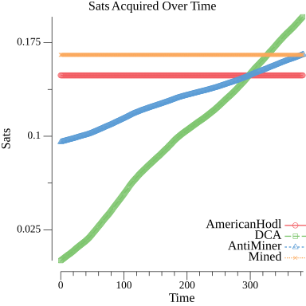

Mining-Profitability

Not that your slush token does expire after some time, and using an expired token will results in the calls to fail.

Flags

`-token` slush pool token (https://slushpool.com/settings/access/)
`-startDate` mm/dd/yyyy format for start date of mining operation
`-kwhPrice` price paid per kilowatt-hour
`-watts` watts used by the miers
`-uptimePercent` percent of time mining operation is online (expressed as an integer)
`-fixedCosts` total costs of miners, hardware, and other operational fixed costs
`-startDate` date of mining operation start
`-messariApiKey` api key from messari.io for historical price data


Example: `go run main.go -token abc123 -startDate 01/01/2022 -kwhPrice .14 -watts 3300 -uptimePercent 98 -fixedCosts 7500`

Output:
```
Bicoin current price: $39149.09
Days since start: 70.29
Average coins per day: 0.00215010
Dollarinos earned: $5916.32
Total electric costs: $763.75
Percent paid off: 71.59%
Expected more days until breakeven: 27.89
Expected breakeven date: 04/09/2022
```


