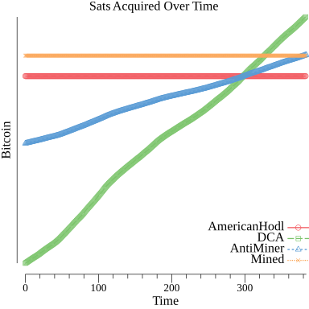

<h1>Mining-Opportunity-Cost-Calculator</h1>

Run this go program with the flags and you will get command line output stats as well as a generated `points.png` file generated in the root of this repo.

Not that your slush token does expire after some time, and using an expired token will results in the calls to fail.

Flags

<ul>
<li><code>-token</code> slush pool token (https://slushpool.com/settings/access/) you can use this flag or the `-bitcoinMined` flag if you dont use slush</li>
<li><code>-startDate</code> mm/dd/yyyy format for start date of mining operation</li>
<li><code>-kwhPrice</code> price paid per kilowatt-hour</li>
<li><code>-watts</code> watts used by the miers</li>
<li><code>-uptimePercent</code> percent of time mining operation is online (expressed as an integer)</li>
<li><code>-fixedCosts</code> total costs of miners, hardware, and other operational fixed costs</li>
<li><code>-startDate</code> date of mining operation start</li>
<li><code>-bitcoinMined</code> amount of bitcoin mined (whole bitcoin units not sats)</li>
<li><code>-messariApiKey</code> api key from messari.io for historical price data</li>
<li><code>-hideBitcoinOnGraph</code> Will hide sats on y-axis of graph, good for opsec when sharing the image. true to hide, false to keep the figure displayed</li>
</ul>

Example: `go run main.go -token abc123 -startDate 01/01/2022 -kwhPrice .14 -watts 3300 -uptimePercent 98 -fixedCosts 7500 -hideBitcoinOnGraph=true`

Output (these are made up figures for the example here):
```
Bicoin current price: $37686.67
Days since start: 320.3
Average coins per day: 0.00032434
Dollarinos earned: $4547.70
Total electric costs: $1256.82
Percent paid off: 44.36%
Bitcoin percentage increase needed to be breakeven: 34.31%
Breakeven price: $56302.90
Expected more days until breakeven: 178.11
Total mining days (past + future) to breakeven: 420.69
Expected breakeven date: 10/11/2022


------------------------------------------------

Electric costs per day: $7.94
bitcoin mined: 0.165
americanHodlSats: 0.14876496984524967
swanSats: 0.19568394600938765
antiHomeMinerSats: 0.16560611084814553
```



<h3>Lines Explained</h3>
<li><b>AmericanHodl</b> - This strategy is if on the first day you slam bought al the sats with all the fiat. This fiat amount is the sum of your mining operations fixed costs plus all the costs in electricity usage</li>
<li><b>DCA</b> Short for "Dollar cost averaging" this strategy refers to taking the sum of the fixed and varialbe costs (electric), dividing this number by total number of days since mining started, and stacked that amount of dollars worth of sats each day</li>
<li><b>AntiMiner</b> This strategy refers to the person who spend an equal number of dollars on bitcoin purchasing each time the miner spends money on a cost. So on the first day, they buy the amount of bitcoin (in fiat terms) equal to the amount for the mining operation's fixed cost setup. Each day after they purchase the amount of bitcoin equal to the amount the miner spent of electricity that day</li>
<li><b>Mined</b> This line represents total bitcoin mined. This tool does not yet support entering amount miner per day to generate a proper historical line, and really should be represented as a singular point all the way on the last day of the x-axis. However, that becomes visually hard to see and for optics I simply had it plot as the entire width of the axis.</li>